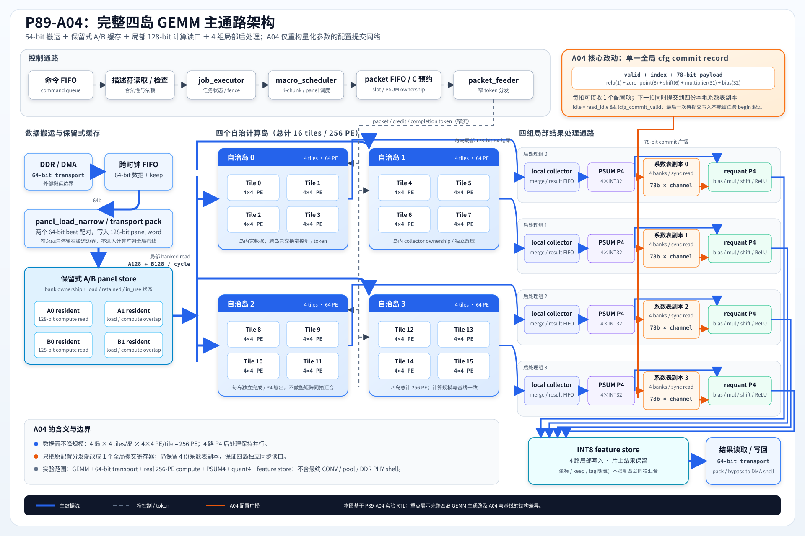

# 星枢 XingShu

[](https://github.com/dogson50/xingshu-riscv-npu/actions/workflows/rtl-ci.yml)
[](LICENSES/CERN-OHL-P-2.0.txt)

**基于自研 RISC-V CPU、流式 NPU 和多通道 DDR-DMA 的 FPGA 边缘智能异构系统。**

> A self-designed RISC-V CPU, streaming NPU and multi-channel DDR-DMA edge AI system on Pango FPGA.



## 项目目标

星枢面向边缘视觉与智能感知场景，计划在紫光同创 PG2L200H FPGA 上集成：

- 自研五级流水 RV32I CPU；
- 自研 v13/A04 四岛式流计算 NPU；
- 自研多通道 DDR-DMA；
- Cache、片上互连、UART、GPIO、中断与定时器；
- INT8 神经网络推理和视频演示应用。

CPU 负责软件执行、系统控制和 NPU 任务调度，NPU 负责矩阵乘、卷积及量化后处理，DDR-DMA 负责权重、特征图和视频流的数据搬运。

## 当前状态

| 模块 | RTL/软件 | 仿真 | 综合/实现 | 上板 |
|---|---|---|---|---|
| v13/A04 NPU | 已导入 | 14 项核心回归 | Vivado 参考实现 | 待移植 PDS |
| RV32I CPU | 规划中 | — | — | — |
| DDR 多通道 DMA | 独立开源仓库 | 已有验证 | Vivado 参考实现 | 待适配 HMIC |
| SoC 集成 | 规划中 | — | — | — |
| 边缘 AI 应用 | 规划中 | — | — | — |

当前 A04 报告中的 300 MHz 数据用于架构横向比较，并不表示完整系统已经在 300 MHz 闭合。竞赛目标器件上的频率和资源数据将在 PDS 实现后单独发布。

## 快速开始

### 克隆（包含 DDR-DMA 子模块）

```bash
git clone --recurse-submodules https://github.com/dogson50/xingshu-riscv-npu.git
cd xingshu-riscv-npu
```

### RTL 回归

需要 Icarus Verilog 11.x 或兼容版本，以及 PowerShell 7：

```powershell
./scripts/run_rtl_tests.ps1
```

当前脚本执行 14 项 NPU 计算、控制、调度、缓存和联合回归。

## 目录

```text
rtl/                    CPU、NPU、SoC、外设和厂商适配层
tb/                     单元测试、集成测试和行为模型
firmware/               BSP、驱动、CoreMark与演示程序
modules/                 可独立复用的Git子模块
fpga/                    PDS与Vivado工程重建入口
constraints/             Pango FDC与Xilinx XDC
scripts/                 仿真、综合和CI脚本
docs/                    架构、接口、验证和竞赛文档
benchmarks/              CoreMark、NPU性能和PPA摘要
```

## 外部依赖

`uiFDMA.v` **不随本仓库分发**。本仓库只维护接口适配层、仿真模型和集成说明。需要 Xilinx 参考工程时，请自行准备合法来源的 `uiFDMA.v`，并设置：

```powershell
$env:UIFDMA_ROOT = 'D:\path\to\uiFDMA'
```

详见 [uiFDMA 外部依赖说明](docs/interfaces/UIFDMA_EXTERNAL_DEPENDENCY.md)。PDS、Vivado、器件 IP、License、模型权重和数据集也不包含在本仓库中。

## 协作

请先阅读 [CONTRIBUTING.md](CONTRIBUTING.md) 和 [ROADMAP.md](ROADMAP.md)。工作流程为：

```text
Issue → 功能分支 → Pull Request → 自动回归 → Review → Squash Merge
```

`main` 分支应始终保持可编译和回归通过。

## 许可证

- 默认硬件设计：CERN-OHL-P-2.0；
- 固件、构建和验证脚本：Apache-2.0；
- 子模块及第三方内容：遵循其各自许可证；
- `uiFDMA.v`：不分发，不属于本仓库授权范围。

具体范围见 [LICENSE.md](LICENSE.md)。